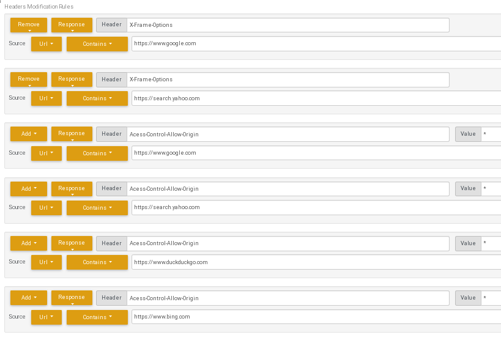

Currently, this lets you search four search engine simultaneously. You can even make it your browser's default search!

For some search engine and browser combinations, you'll need to modify the incoming HTTP headers for this software to work properly.

Here is an example of which modifications you may need to make:

https://blakelapierre.github.io/multi-search-www

You can use https://blakelapierre.github.io/multi-search-www?q= + your query to integrate with your browser's search feature or to enter url's that will execute a search.